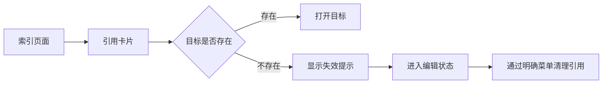

# HyperCortex

Fast Window v5 本地知识工作台，用于整理笔记、附件、收藏夹索引与阅读工作流。

## 功能根系

- 笔记用于承载文字内容与阅读整理结果。
- 附件用于承载本地导入的文件资源。
- 收藏夹用于组织索引页面里的引用卡片。
- 索引页面通过卡片呈现收藏夹、笔记和附件入口。
- 失效引用卡片只提示目标已经不存在，不承担直接清理动作。
- 清理引用需要进入编辑状态后，通过卡片右上角的明确菜单执行。

## 技术边界

- 本地后台负责笔记、附件和收藏夹资料的保存与读取。
- 界面负责展示、打开、编辑、添加、排序和清理入口。
- 索引页只调整卡片交互，不改变底层资料保存语义。

## 交互流转

## 常用命令

- `pnpm build:ui`
- `go test ./...`
- `pnpm tauri build`
