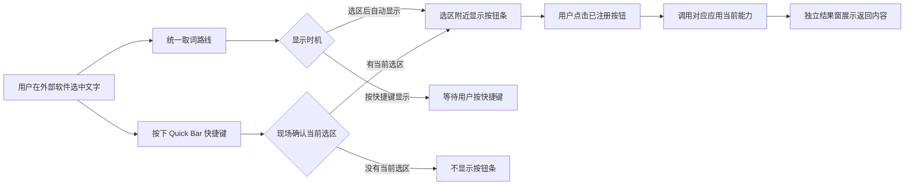
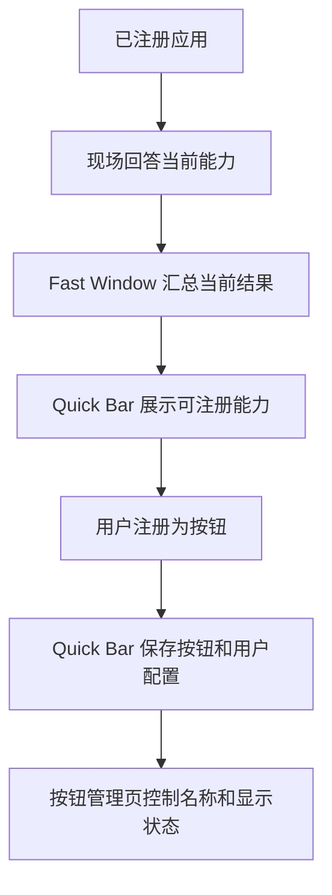

# Quick Bar

Quick Bar 是 Fast Window v5 应用体系中的划词快捷工具条。用户在外部软件中选中文字后，Quick Bar 会通过统一取词路线读取当前有效选区，并按用户选择的显示时机在选区附近显示轻量按钮条；点击按钮后，能力调用结果会在独立结果窗中显示。

## 当前阶段

- 应用 ID：`quick-bar`
- 应用名称：`Quick Bar`
- 当前版本：`0.1.0`
- 当前定位：划词后触发已注册能力
- 当前系统支持：Windows 统一取词路线与选区读取
- 默认唤醒快捷键：`control+alt+Q`
- 默认显示时机：按快捷键显示
- 可选显示时机：选区后自动显示
- 按钮来源：用户在 Quick Bar 中注册的能力按钮
- 按钮管理：独立页面管理已注册按钮的改名、启用、停用和删除
- 按钮图标：轻量图标库，提供不少于 200 个纯图标选项，注册和管理时都可以选择或随机图标
- 操作按钮：注册、编辑、保存、停用和删除使用统一现代按钮样式
- 结果展示：独立结果窗，不拉高按钮条
- 窗口外观：按钮条为白色圆角矩形并带柔和外部阴影，结果窗为白色圆角窗口
- 窗口底色：外层保持透明，只显示白色圆角窗口本体
- 窗口轮廓：浮窗外圈不使用描边线

## 工作方式



## 能力按钮来源

Quick Bar 不把其他应用“能做什么”当作自己的长期事实保存。它只保存用户已经注册的按钮，以及这些按钮对应的用户配置。

主窗口顶部栏提供“设置”“已注册管理”“能力浏览”三个固定入口，不再通过主页中转。已注册按钮管理页只读取 Quick Bar 自己保存的按钮记录，不启动其他应用，也不重新读取其他应用的能力清单。

注册按钮时可以自定义按钮名称。已注册按钮管理页中，用户可以修改名称、停用、重新启用或删除按钮。停用按钮会保留记录，但不会出现在划词后的按钮条中；删除按钮会移除这条按钮记录。

## 按钮图标

- Quick Bar 接入轻量图标库，提供不少于 200 个纯图标选项；注册按钮时可以直接选择，也可以用随机图标快速切换。
- 已注册按钮会保存图标信息；按钮管理页可以继续修改图标，不会影响名称、配置和启用状态。
- 图标选择面板只显示图标，不在每个图标下面显示名称。
- 图标选择面板使用统一小尺寸图标墙，避免图标撑开注册页或编辑弹窗。
- 按钮条只显示图标，鼠标悬停时才显示按钮名称，避免按钮条被文字撑宽。
- 按钮条可见主体保底 160px 宽；按钮从左侧起排，使用微缩图标，超过保底后按真实图标内容继续加宽，避免图标按钮被整条栏平均拉宽。
- 如果按钮没有明确图标，系统会按按钮自身信息生成稳定默认图标，保证同一按钮外观稳定。

能力浏览时，Fast Window 默认只询问已经运行的已注册应用；Quick Bar 只展示这次安静读取得到的结果。如果某个应用未运行或暂时无法回答，界面会显示原因，而不是自动启动它，也不会拿旧菜单冒充当前能力。

用户需要读取某个未运行应用时，可以点击对应的“启动并读取”动作。这个动作只针对用户点选的单个应用，不会批量启动其他应用。



## 快捷键管理

Quick Bar 的浮动条唤醒快捷键由应用自己管理，不需要在 Fast Window 平台里为浮动条额外绑定快捷键。快捷键不是选区读取机制本身，而是默认的显示门槛：用户按下快捷键时，后台会现场确认当前是否仍有有效选区；有选区且能对应到实际划选位置时才显示浮动条，没有选区就保持隐藏。

- 在主窗口的“快捷键”页可以录制并保存唤醒快捷键。
- 应用启动后会自动注册保存的快捷键。
- 快捷键注册失败时，主窗口会显示当前状态和错误信息。
- 快捷键至少需要包含一个修饰键，避免误触普通按键。

## 统一取词路线

Quick Bar 现在用统一取词路线接住“文字被选中了”这件事，再把这件事交给后台统一处理。后台会先等待外部软件的选区状态稳定，再读取当前可用的文字和位置。

- 统一取词路线拿到选中文字后，会把这次文字和位置直接交给当前显示流程。
- 按快捷键显示时，后台会在按键当下重新确认当前文字，不拿上一次文字冒充当前文字；显示位置仍使用实际划选时留下的位置。
- 取词路线会把文字、位置和来源一起交给 Quick Bar。
- 取词路线暂时拿不到结果时，会留下节制的失败原因记录，便于继续排查具体软件差异。
- 显示时机设为“选区后自动显示”时，后台会直接显示按钮条。
- 显示时机设为“按快捷键显示”时，后台不会因为历史选区主动打扰用户。
- 取词只是入口，真正是否显示仍由显示时机决定。

统一取词路线直接由后台小帮手读取选中文字和位置，Quick Bar 使用同一套当前选区确认和显示时机，不维护第二套取词路线。

## 显示时机

Quick Bar 的后台选区观察和浮动条显示时机是分开的。

- 按快捷键显示：按下唤醒快捷键时现场确认当前文字，并配对实际划选位置；两者配上才显示浮动条。
- 选区后自动显示：后台发现新的有效选区后，直接在选区附近显示浮动条。
- 两种方式都使用同一套当前选区读取能力，不维护两套互相竞争的取词逻辑。
- 浮动条窗口本体就是按钮条，不再保留外壳套内条的视觉层级。

## 窗口职责

Quick Bar 保持三个窗口职责分离：

- 主窗口：通过顶部栏进入设置、已注册按钮管理和能力浏览三个页面。
- 按钮条窗口：只展示当前可点击按钮，不展示选中文字和结果内容。
- 结果窗：展示能力调用过程、成功结果或失败原因。

## 平台命令

平台命令只保留管理入口，不承担浮动条唤醒职责。

| 命令 | 用途 |
|---|---|
| `open-settings` | 打开主窗口，并进入设置概览。 |
| `show-health` | 打开主窗口，并进入后台健康状态。 |

## 数据与后台

- 应用会保存用户选择的数据目录位置。
- 应用会保存用户录制的唤醒快捷键。
- 应用会保存用户选择的浮动条显示时机。
- 应用会保存用户注册的按钮名称、按钮图标和按钮配置。
- 应用会保存已注册按钮的启用状态。
- 应用不会把其他应用当前能提供的能力清单保存成长期菜单。
- 默认数据目录由应用运行位置自动计算。
- Go 后台负责 Quick Bar 自己的数据读写、按钮登记和健康检查。
- 数据目录会写入 `_meta.json` 和 `_migrations.json`，用于保留后续数据演进基础。

## 开发命令

在仓库根目录可执行：

```powershell
pnpm --dir apps/quick-bar build:backend
pnpm --dir apps/quick-bar build:ui
pnpm --dir apps/quick-bar exec tsc --noEmit
cargo check --manifest-path apps/quick-bar/src-tauri/Cargo.toml
```

在 Go 后台目录可执行：

```powershell
go test ./...
```

## 构建命令

```powershell
pnpm --dir apps/quick-bar build:app:dev
pnpm --dir apps/quick-bar build:app
```

`build:app:dev` 用于生成本地开发版应用容器，`build:app` 用于生成本地正式版应用容器。

## 手工验收清单

- 独立启动时显示主窗口和托盘入口。
- 开发构建启动时可以看到统一取词路线就绪日志。
- 主窗口“快捷键”页可以录制并保存唤醒快捷键。
- 能力浏览页默认只读取已运行应用，不自动启动其他应用。
- 部分应用未运行或无法回答能力时，能力浏览页显示失败原因。
- 点击某个应用的“启动并读取”后，只启动并读取这个应用。
- 用户可以把可用能力注册为悬浮栏按钮，并自定义按钮名称。
- 用户可以在注册时选择图标，也可以用随机图标快速切换。
- 注册页、编辑弹窗和已注册管理页的动作按钮保持统一现代样式，图标编辑弹窗使用图标墙和窄操作区的正常比例。
- 用户可以从顶部栏进入“已注册管理”页面。
- 用户可以修改已注册按钮名称，修改后悬浮条使用新名称。
- 用户可以在已注册管理页修改按钮图标，修改后按钮条使用新图标。
- 用户可以停用已注册按钮，停用后按钮保留但不出现在划词按钮条中。
- 用户可以重新启用已停用按钮，启用后按钮重新出现在划词按钮条中。
- 用户可以删除已注册按钮，删除后按钮记录被移除。
- 外部选中文字后，统一取词路线能够被后台接住，并在选区稳定后读取当前文字和位置。
- 显示时机设为“按快捷键显示”时，按 Quick Bar 保存的快捷键会现场确认当前选区；有选区才显示按钮条，没有选区不显示。
- 显示时机设为“选区后自动显示”时，选中文字后按钮条自动显示在选区附近。
- 按钮条窗口本体填满为按钮条，不出现外框套内条的分离视觉。
- 按钮条使用白色圆角矩形并带柔和外部阴影，结果窗使用白色圆角窗口，外层透明且外圈无描边线。
- 按钮条只显示已启用的已注册按钮，且只展示图标，不展示选中文字。
- 按钮条可见主体保底 160px 宽；按钮从左侧起排，宽度跟随微缩图标内容，不再把整条栏平均分给每个按钮。
- 鼠标悬停按钮时能看到按钮名称。
- 点击按钮后，独立结果窗准备好并出现在选区附近，按钮条随后隐藏。
- 能力调用中、调用成功、调用失败都有明确显示。
- 按钮条失焦、点击其他地方或按 `Esc` 后隐藏。
- 结果窗按 `Esc` 或关闭按钮后隐藏。
- 平台触发 `open-settings` 时打开主窗口并显示设置概览。
- 平台触发 `show-health` 时打开主窗口并显示后台健康状态。
- 数据目录不可写时，主窗口显示错误状态。

## 当前不包含

- 不要求在 Fast Window 平台里为浮动条绑定快捷键。
- 不把快捷键当作唯一取词机制；快捷键只是默认显示门槛。
- 不保留第二套取词路线。
- 不提供跨平台选区读取实现。
- 不在 Quick Bar 中长期保存其他应用的当前能力清单。
