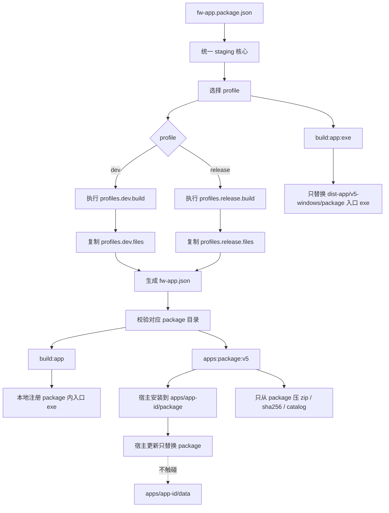

# v5-reference-app-go

Go sidecar 版本的 Fast Window v5 App 模范实现。

这个 App 的目标不是提供业务功能，而是作为所有 v5 registered app 的可运行标准样板。新 App 可以复制本目录，再替换命名、图标、业务 UI 和业务 sidecar。

## 包含的标准能力

- 独立 Tauri v2 App 壳。
- Go sidecar 独立 exe，Rust 壳负责启动和停止。
- Rust 壳本地拥有 `backend_lifecycle.rs`，用 `BackendProcessState` 管理 sidecar 子进程、endpoint、运行时错误和退出清理。
- FW control：`127.0.0.1:0`、随机 token、`fw-app-control-ready`、`POST /control`。
- App 单实例：`127.0.0.1:0`、随机 token、状态文件、响应身份校验。
- 单实例状态按 Tauri desktop identifier 隔离，dev/release 不串实例。
- FW 模式和 standalone 模式分离。
- standalone 托盘：显示窗口、退出。
- unified shutdown：上报窗口边界、停止 sidecar、清理单实例状态、退出主进程。
- 自绘顶部栏，空白区域手动 `startDragging()`。
- 数据目录指针与业务数据分离。
- sidecar 启动前检查业务数据目录可写。
- `backend_endpoint` 必须先确保 sidecar 正在运行，再返回 endpoint；前端不得复用睡眠前的旧 endpoint 作为唯一真相。
- 前端 direct client 必须是可恢复连接状态机：检测 `close`、`error`、`visibilitychange`、`focus`、`online` 和睡眠恢复时间跳变，并重新调用 `backend_endpoint` 建立新 WebSocket。
- 前端 direct client 对外方法必须可安全传递：`request`、`close` 等公开 API 应使用函数属性或闭包对象，不能依赖会在 props/回调传递中丢失的 `this`。
- Go 侧 `schemaVersion`、`dataVersion`、`_migrations.json`、`_meta.json` 骨架。
- 前端加载态、错误态、数据目录选择、运行中 command 接收演示。
- 标准构建脚本：`build:backend`、`build:resources`、`build:ui`、`build:exe:dev`、`build:exe`、`build:app`、`build:app:dev`、`build:app:exe`、`build:app:exe:dev`。
- 标准 v5 App 包声明：`fw-app.package.json`，统一生成 `dist-app/v5-windows/` 本地 app 容器目录。
- 标准版本脚本：`apps:version:check`、`apps:bump`、`apps:bump:dry`，所有 App 版本目标必须一致后才允许升版。

## 复制成新 App 时必须替换

| 项 | 当前值 | 新 App 替换建议 |
|---|---|---|
| 目录名 | `v5-reference-app-go` | `your-app-id` |
| package name | `@fast-window/app-v5-reference-app-go` | `@fast-window/app-your-app-id` |
| Tauri package | `v5-reference-app-go` | `your-app-id-app` 或 `your-app-id` |
| productName | `v5 Reference App Go` | 产品名 |
| release identifier | `com.fastwindow.v5referenceappgo` | `com.fastwindow.<app>` |
| dev identifier | `com.fastwindow.v5referenceappgo.dev` | `com.fastwindow.<app>.dev` |
| Rust app id | `v5-reference-app-go` | 注册 App ID |
| sidecar exe | `v5-reference-app-go-backend` | `<app-id>-backend` |
| settings file | `v5-reference-app-go-settings.json` | `<app-id>-settings.json` |
| Vite port | `1434` | 未占用端口 |
| commands | `open-reference`、`show-health`、`edit-settings` | App 自己的命令 |
| apps:bump 脚本 | `node ../../scripts/bump-v5-app-version.mjs` | 保持相同命令，由 cwd 自动识别 App ID |
| fw-app.package.json | `v5-reference-app-go` 声明 | 替换 app id、名称、入口 exe、sidecar、图标和命令 |

## 复制后保留不变的机制

- control server 协议字段。
- single-instance 动态端口和状态文件结构。
- token 生成方式。
- shutdown 顺序。
- 后端生命周期顺序：确保数据目录可写，启动 sidecar，读取 stdout ready 帧，记录 endpoint；sidecar 退出或状态读取失败时必须清空 endpoint 并记录运行时错误。
- `backend_endpoint` 的语义：调用时负责恢复后端可用性，而不是只读取缓存 endpoint。
- WebSocket 恢复策略：断线后 reject 当前 pending request，后续请求重新连接；睡眠/锁屏恢复时强制刷新旧 WebSocket 并重新取 endpoint。
- direct client 公开 API 的绑定语义：公开函数必须脱离对象仍可调用，允许被 React props、回调、变量解构传递。
- direct client 创建生命周期：工厂函数只有在初次连接成功后才能返回 client；初次连接或握手失败时必须关闭 client、清理恢复监听和 pending request，并原样抛出错误。
- `build:ui` 作为所有构建入口的前置步骤。
- `build:app` 是本地 release 注册的标准入口，输出 `dist-app/v5-windows/` app 容器，并只替换其中的 `package/`。
- `build:app:dev` 是本地 dev 注册的标准入口，输出 `dist-app/v5-windows-dev/` app 容器，并只替换其中的 `package/`。
- app 自己管理数据目录；用户自选数据目录优先，未配置时才使用标准默认目录。
- 默认数据目录标准：exe 位于 `package/` 下时使用 `package` 同级的 `data/`；exe 不在 `package/` 下时使用 exe 同目录的 `data/`。
- `build:app:exe` 只替换已存在 `dist-app/v5-windows/package/` 中的入口 exe；资源、图标、命令或 package 声明变化时必须跑 `build:app`。
- `apps:bump` 只能调用根目录统一版本脚本；不得在单个 App 内复制升版逻辑。
- `package.json`、`src-tauri/tauri.conf.json`、`src-tauri/tauri.conf.dev.json`、`src-tauri/Cargo.toml`、`src-tauri/Cargo.lock` 的 App 自身版本必须保持一致。
- 数据目录可写检测。
- migration runner 和 ledger 概念。
- 顶部栏手动拖拽策略。

## 标准 v5 App 构建链路

v5 App 的本地产物、快速更新和正式发布必须共用同一套 staging 机制。不要把 `src-tauri/target/release` 里的裸 exe 当作可注册应用目录。

### 核心目录

每个 v5 App 的完整 release 本地 app 容器目录固定为：

```txt
apps/<app-id>/dist-app/v5-windows/
```

dev 本地 app 容器目录固定为：

```txt
apps/<app-id>/dist-app/v5-windows-dev/
```

这个目录是本地可运行 app 容器，必须至少包含：

- `package/`：程序包根目录，会被 `build:app` / `build:app:dev` 原子替换。
- `data/`：本地默认数据目录，staging 命令不得删除、替换或打包它。

`package/` 必须等同于正式 zip 解压后的程序包根目录，至少包含：

- `fw-app.json`
- `fw-app.json.windowsExecutable` 指向的入口 exe
- `fw-app.json.icon` 指向的图标文件或资源
- 当前 profile 的 `profiles.<profile>.files` 声明的所有资源

注册 release v5 App 时，应从 `apps/<app-id>/dist-app/v5-windows/package/` 里选择入口 exe；注册 dev v5 App 时，应从 `apps/<app-id>/dist-app/v5-windows-dev/package/` 里选择入口 exe。

商店安装后的标准容器布局固定为：

```txt
apps/<app-id>/
  package/
    fw-app.json
    <entry>.exe
    ...resources
  data/
```

宿主只管理 `package/` 的安装和更新，不决定 app 数据目录，不注入数据目录变量。app 的默认数据目录由 app 自己按当前 exe 目录计算：如果 exe 在 `package/` 下，默认目录是 `../data/`；如果 exe 不在 `package/` 下，默认目录是 exe 同目录的 `data/`。用户自选数据目录始终优先于默认目录。

### 命令职责

| 命令 | 作用 | 输出/影响 |
|---|---|---|
| `pnpm build:exe` | 裸 Tauri exe 构建，保留给底层验证和旧习惯 | `src-tauri/target/release/` |
| `pnpm build:app` | 完整生成本地 release app 容器 | 只替换 `dist-app/v5-windows/package/` |
| `pnpm build:app:dev` | 完整生成本地 dev app 容器 | 只替换 `dist-app/v5-windows-dev/package/` |
| `pnpm build:app:exe` | 只重建并同步入口 exe 到已存在的 package | 替换 `dist-app/v5-windows/package/<entry>.exe` |
| `pnpm build:app:exe:dev` | 只重建并同步 dev 入口 exe 到已存在的 package | 替换 `dist-app/v5-windows-dev/package/<entry>.exe` |
| `pnpm apps:stage:v5 -- --app <id>` | 根目录统一 release staging 入口 | 只替换 `apps/<id>/dist-app/v5-windows/package/` |
| `pnpm apps:stage:v5:dev -- --app <id>` | 根目录统一 dev staging 入口 | 只替换 `apps/<id>/dist-app/v5-windows-dev/package/` |
| `pnpm apps:sync-exe:v5 -- --app <id>` | 根目录统一入口 exe 同步 | 替换 `apps/<id>/dist-app/v5-windows/package/<entry>.exe` |
| `pnpm apps:sync-exe:v5:dev -- --app <id>` | 根目录统一 dev 入口 exe 同步 | 替换 `apps/<id>/dist-app/v5-windows-dev/package/<entry>.exe` |
| `pnpm apps:package:v5 -- --app <id>` | 从同一 staging 容器的 `package/` 生成正式 zip 和 catalog | `.tmp/dist-v5-apps/` |

### 推荐工作流

首次本地注册或资源、图标、命令、打包清单变化后：

```powershell
pnpm --dir apps/<app-id> build:app
```

首次本地注册 dev 版，或 dev 版资源、图标、命令、打包清单变化后：

```powershell
pnpm --dir apps/<app-id> build:app:dev
```

只改了入口 exe 代码，希望保留注册路径并快速替换：

```powershell
pnpm --dir apps/<app-id> build:app:exe
```

只改了入口 exe 代码，希望保留 dev 注册路径并快速替换：

```powershell
pnpm --dir apps/<app-id> build:app:exe:dev
```

正式发布前生成 zip 和 catalog：

```powershell
pnpm apps:package:v5 -- --app <app-id>
```

### 架构



### 约束

- `build:app:exe` 要求对应 staging 容器 `package/` 里的 `fw-app.json` 与当前 `fw-app.package.json` 生成结果一致；不一致时必须先跑完整 `build:app` 或 `build:app:dev`。
- `build:app:exe` / `build:app:exe:dev` 只同步 `package.windowsExecutable` 对应的文件，不同步资源和 manifest。
- 如果 app 正在运行导致 Windows 锁定 exe，命令应失败；先停止 app，再重新执行。
- 新 v5 App 必须提供 schema 2 的 `fw-app.package.json`，并接入 `build:app` / `build:app:dev` / `build:app:exe` / `build:app:exe:dev`。
- 正式发布不得绕过 staging 容器；zip 必须从 `dist-app/v5-windows/package/` 复制生成，严禁包含 `dist-app/v5-windows/data/`。

### 新 App 接入清单

- 在 `apps/<app-id>/fw-app.package.json` 声明 `profiles.release`、`profiles.dev`、`package.windowsExecutable`、`package.icon`、`commands`。
- 在 `apps/<app-id>/package.json` 增加：
  - `"build:app": "node ../../scripts/stage-v5-app.mjs"`
  - `"build:app:dev": "node ../../scripts/stage-v5-app.mjs --profile dev"`
  - `"build:app:exe": "node ../../scripts/sync-v5-app-exe.mjs"`
  - `"build:app:exe:dev": "node ../../scripts/sync-v5-app-exe.mjs --profile dev"`
- 确保每个 `profiles.<profile>.files` 中都有一条 `to` 等于 `package.windowsExecutable` 的入口 exe 映射。
- 确保 `commands` 与 app 运行时上报的 available commands 保持一致。

## 验收命令

```powershell
pnpm --dir apps/v5-reference-app-go build:backend
pnpm --dir apps/v5-reference-app-go apps:version:check
pnpm --dir apps/v5-reference-app-go apps:bump:dry
go test ./...
pnpm --dir apps/v5-reference-app-go build:ui
cargo check --manifest-path apps/v5-reference-app-go/src-tauri/Cargo.toml
pnpm --dir apps/v5-reference-app-go exec tsc --noEmit
pnpm --dir apps/v5-reference-app-go exec vite build
pnpm --dir apps/v5-reference-app-go build:exe:dev
pnpm --dir apps/v5-reference-app-go build:app
pnpm --dir apps/v5-reference-app-go build:app:dev
pnpm --dir apps/v5-reference-app-go build:app:exe:dev
```

`go test ./...` 需要在 `apps/v5-reference-app-go/backend-go` 目录执行，或使用等价的 `go test ./apps/v5-reference-app-go/backend-go/...` 风格命令。

## 手工验收清单

- standalone 启动时显示任务栏和托盘。
- standalone 关闭按钮隐藏到托盘，不退出主进程。
- 托盘“显示窗口”可唤醒窗口。
- 托盘“退出”停止 Go sidecar 并退出主进程。
- FW 启动时不显示托盘和 standalone 窗口控制按钮。
- FW `show` 显示并聚焦。
- FW `hide` 隐藏窗口。
- FW `toggle` 显示/隐藏切换。
- FW `close` 走统一 shutdown。
- 重复启动不会产生第二个主实例。
- dev/release 可各自独立运行，不互相转发。
- 数据目录不可写时前端显示错误态。
- 切换数据目录后 sidecar 重启并连接新目录。
- 移动/缩放窗口后 stdout 上报 `fw-app-window-bounds`。
- 电脑睡眠或锁屏恢复后，前端能重新连接 sidecar，后续 RPC 不长期停留在 WebSocket closed 状态。
- sidecar 被系统或外部原因结束后，再次调用 `backend_endpoint` 能启动新 sidecar 并返回新 endpoint。
- direct client 的公开方法被作为 props 或回调传递后仍能工作，不允许因为 `this` 丢失导致白屏。
- direct client 初次连接失败时不残留 `visibilitychange`、`focus`、`online` 或 interval 恢复监听。

## 不应加入模范 App 的内容

- 业务 UI。
- 真实业务 RPC。
- 插件时代的 `window.fastWindow`。
- 插件时代的 `background.endpoint`。
- 固定 control 端口。
- 时间戳或 pid 拼接 token。
- 长期运行时读取旧插件目录的 fallback。
- 只在前端吞掉 WebSocket 错误但不重连的兜底。
- 只缓存 endpoint、不确认 sidecar 存活的 `backend_endpoint`。
- 依赖 class prototype 方法作为公开 client API，导致函数脱离对象后丢失 `this`。
- direct client 工厂函数在初次连接失败后不关闭半成品 client，导致恢复监听或定时器残留。
